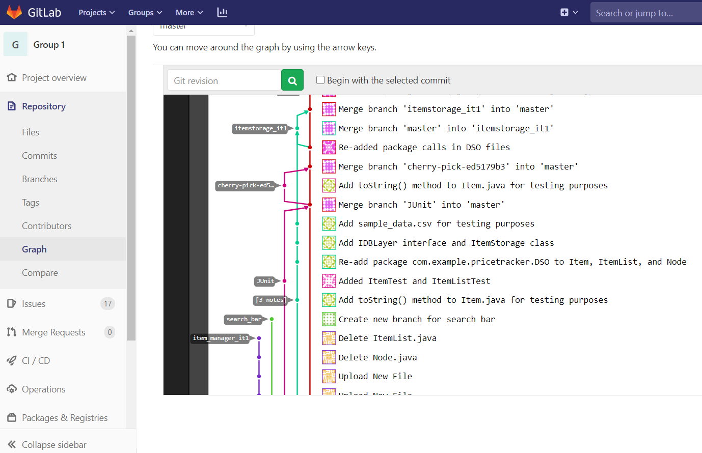

Iteration 1 Worksheet
=====================

Adding a feature
-----------------

We added the [Item cost](https://code.cs.umanitoba.ca/3350-winter-2021-a02/group-1/-/issues/11) feature during this iteration. It was linked to the item information and item picture feature, as well as to user story [seeing price of items](https://code.cs.umanitoba.ca/3350-winter-2021-a02/group-1/-/issues/2). The initial steps for this feature involved the data storage, data retrieval, and *Item* construction. Some of the tests for this included the [ItemList test](https://code.cs.umanitoba.ca/3350-winter-2021-a02/group-1/-/blob/master/app/src/test/java/com/example/pricetracker/DSO/ItemListTest.java) and [price testing](https://code.cs.umanitoba.ca/3350-winter-2021-a02/group-1/-/blob/master/app/src/test/java/com/example/pricetracker/DSO/ItemTest.java). The initial [parsing from file](https://code.cs.umanitoba.ca/3350-winter-2021-a02/group-1/-/blob/master/app/src/main/java/com/example/pricetracker/DSO/ItemStorage.java) was integral to implementing this feature.

When merging this feature into the master, we first needed to add the [unit tests](https://code.cs.umanitoba.ca/3350-winter-2021-a02/group-1/-/merge_requests/3) for classes (including the *Item* class, where price is first defined as an attribute), then we [cherry-picked](https://code.cs.umanitoba.ca/3350-winter-2021-a02/group-1/-/merge_requests/4) from the *itemstorage_it1* branch, and then fully merged from the data [storage branch](https://code.cs.umanitoba.ca/3350-winter-2021-a02/group-1/-/merge_requests/5) (reading in items and their costs and constructing *Item*s). At this point the feature was fully merged into the master. 

Exceptional code
----------------

In this [exception testing example](https://code.cs.umanitoba.ca/3350-winter-2021-a02/group-1/-/blob/master/app/src/main/java/com/example/pricetracker/DSO/ItemStorage.java), *FileReader()* is passed a database (in this iteration this is a csv file) and an attempt is made to open the file, parse and format elements from each line, create an *Item* from each line, add the *Item* to an *ItemList* object, and then close the file. If the database (or file) being passed is not found, a "file not found" error message is displayed, and if for some other reason this method does not succeed, a generic error message is reported.

Branching
----------

[Our branching strategy](https://code.cs.umanitoba.ca/3350-winter-2021-a02/group-1/-/blob/master/branching_strategy.md) uses GitLab Flow.

With our version of this strategy, features are branched off of the stable master branch. To get to this point, we cherry-pick from work in progress branches until the master is stable and up-to-date, and then branch off into a feature branch. This screenshot is of parts of the *JUnit* testing branch (pink) being merged piece by piece into a regulated master (red) (making sure that it builds properly with each new addition or edit.) New feature branches (like the *ItemStorage* feature in turquoise) then pull from the stable master branch.

SOLID
-----

We found a SOLID principle violation where the open-closed principle was violated. [Link to issue.](https://code.cs.umanitoba.ca/3350-winter-2021-a02/group-10/umplanner-comp3350-a02-group10/-/issues/55) 

This violation was found in the UMPlanner project, in the *getSemester()* method in a *Course* class. Any changes to term structure or even naming at the University of Manitoba (like a split Summer session) would require modification, instead of just needing an extension. It may be unlikely (and so not require changing) but the principle is technically violated. 

Agile Planning
--------------

A major change in plans involved the UI, where we ended up needing to implement a search bar and list view pair that read from a basic list of items, but not the DSO being passed across layers. In other words, the presentation layer works separately from the other two. In our next iteration, a high priority feature is now to integrate DSO with the UI component so that the data read in from the database is actually what is shown. The initial (now changed) feature was the [Item search - basic view](https://code.cs.umanitoba.ca/3350-winter-2021-a02/group-1/-/issues/10) feature, and the one we created (and pushed) to the next iteration is [Integrated item search](https://code.cs.umanitoba.ca/3350-winter-2021-a02/group-1/-/issues/18) feature.

We changed the description of the [item picture feature](https://code.cs.umanitoba.ca/3350-winter-2021-a02/group-1/-/issues/13), to reflect the use of links to placeholder images during this iteration, instead of using actual images. The most straightforward way to pass images between classes with our architecture and the state of our system is to pass a link to a product's image as an attribute of the *Item* class. Using actual image links would require web scraping. We will reconsider whether this is something we want to implement, or if it would suit our system more to replace the placeholder images with simple representative icons or symbols, or if links to actual images would be better.
Similarly, we made a minor edit to the description of the [item information feature](https://code.cs.umanitoba.ca/3350-winter-2021-a02/group-1/-/issues/12), as we are also using placeholder information here. In this case we know that we would need to get actual data, but this part we will push to a future iteration.
